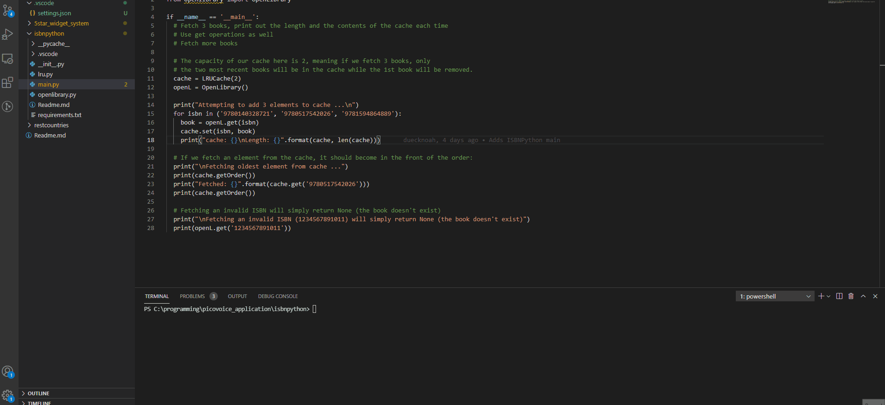

# OpenLibrary Wrapper

An OpenLibrary wrapper with cache for fetching book records from there ISBN using Python.

## How to run
Install requirements: `pip install -r requirements.txt`
Then run with `python main.py`

## Notes
- have a dictionary cache where the [isbn](https://en.wikipedia.org/wiki/International_Standard_Book_Number) is the key and the title, author, and language and other data from the book is stored as the value
- [openlibrary](https://openlibrary.org/developers) provides us with an open API to hit to fetch a variety of book data from title, author, language,

### How it Works
We use a [LRU cache](https://leetcode.com/problems/lru-cache/) to store max N elements of book records. Anytime the cache exceeds
that it will remove the least recently used element. In our case it is the least recently used book. Fetching an elenent (book) from
the cache will move it to the front of the cache as it was most recently used.

On top of this, I created a wrapper for contacting the [openlibrary API](https://openlibrary.org/developers) and retrieving
the title, authors, and languages of a desired book based off its ISBN13 number.